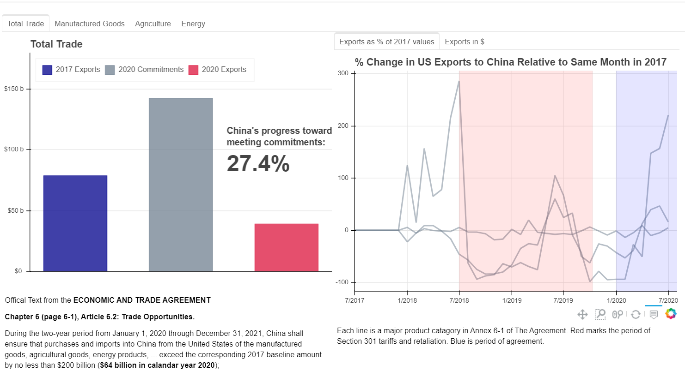

### [US China Trade War Tracker](https://www.tradewartracker.com/)

---

**About the Tracker:** ​The goal is simple: Visually track the US and China trade war, provide easy access to the data and code behind the presentation, do so in a way that is essentially "live" (as the US census releases the data, the data and figures will be automatically updated).

**About the Repository:** Again the goal is to provide easy access to the data and resources to better understand the Phase One Trade Agreement and the Trade war. The code repository contains all the notebooks; almost all code is directly fetched from US government sources. Clean up is in Progress, basic outline is described below.

---
#### [Phase-One Tracker](https://www.tradewartracker.com/)

There are several components to creating these visuals.

  - [make-phase-one-product-list.ipynb](make-phase-one-product-list.ipynb) creates the list of products that are coverd by the Phase One aggreement in Annex 6-1.

  - [phase-one-trade.ipynb](phase-one-trade.ipynb) grabs the trade data, product list, and then county-level informaiton to creat the figures on the main site.

  - [phase-one-plots.ipynb](phase-one-plots.ipynb) creates the plots for the first panel on the website (goals and time series plots).

  - [phase-one-map.ipynb](phase-one-map.ipynb) creates the map of the county level gain in exports per worker to China.

  ---
